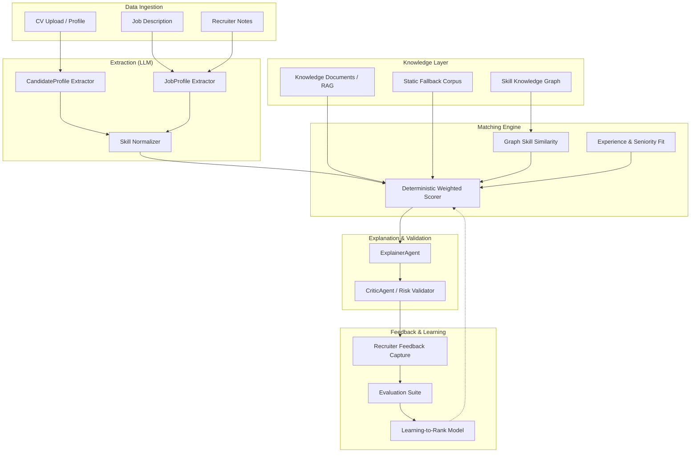

# AI Level-5 Roadmap — Explainable Hybrid AI Recruitment Engine

> **Status**: Aspirational architecture direction. Items are labeled by implementation phase.
> **Governing spec**: `skills/OPENSPEC.md`
> **Last updated**: 2026-05-16

---

## Vision

Evolve Smart CV Matcher from a demo-grade AI matching tool into a **Level-5 Explainable Hybrid AI Recruitment Engine** that combines:
- LLM-powered extraction and explanation
- graph-based skill similarity
- deterministic weighted scoring
- RAG-grounded evidence
- recruiter feedback learning

The system must remain **explainable**, **deterministic in scoring**, and **auditable** at every stage.

---

## Architecture Layers

---

## Component Roadmap

### 1. LLM Extraction Layer

| Item | Status | Notes |
|------|--------|-------|
| CandidateProfile extraction via LLM | **Current** | Implemented in `ExtractorAgent` |
| JobProfile extraction via LLM | **Current** | Implemented in `ExtractorAgent` |
| Heuristic fallback extraction | **Current** | Active when LLM unavailable |
| PII masking before LLM | **Current** | Applied to candidate content |
| Skill normalization (canonical mapping) | **Next** | Planned — map skill name variants to canonical IDs |
| JD quality validation | **Next** | Planned — warn recruiters about vague/incomplete JDs |
| Fine-tuned SLM for extraction | **Future** | Not in MVP — requires labeled extraction dataset |

### 2. Skill Knowledge Graph

| Item | Status | Notes |
|------|--------|-------|
| Flat skill matching (exact + alias) | **Current** | Used by MatcherAgent |
| Skill taxonomy / hierarchy | **Next** | Planned — curated IT skill tree |
| Graph-based skill similarity | **Future** | Not in MVP — enables partial credit for related skills |
| GNN-based skill reasoning | **Future** | Aspirational — requires substantial graph data |

### 3. RAG Grounding

| Item | Status | Notes |
|------|--------|-------|
| Static fallback corpus | **Current** | Active when pgvector unavailable |
| OpenAI embeddings + pgvector retrieval | **Current** | Implemented in KnowledgeRetriever |
| `knowledge_documents` table (Laravel) | **Current** | Schema ready, basic seeding |
| Expanded static IT knowledge corpus | **Next** | Planned — curated job-family and skill reference data |
| Dynamic document management UI | **Future** | Not in MVP |
| Multi-source retrieval (web, papers) | **Future** | Aspirational |

### 4. Deterministic Weighted Scoring

| Item | Status | Notes |
|------|--------|-------|
| 6-component weighted scorer | **Current** | Implemented — see Scoring Specification in OPENSPEC |
| Score breakdown per component | **Current** | Used in shortlist UI |
| Neutral handling for missing data | **Current** | No penalty for absent optional fields |
| Per-job scoring config overrides | **Next** | Schema ready (`jobs.scoring_config`), pipeline/UI not connected |
| Graph-augmented skill coverage | **Future** | Depends on skill knowledge graph |

### 5. Explanation & Validation

| Item | Status | Notes |
|------|--------|-------|
| ExplainerAgent (recruiter rationale) | **Current** | LLM-generated reasoning |
| CriticAgent (confidence validation) | **Current** | Edge-case and risk-flag checks |
| Matched/missing skills display | **Current** | Rendered in shortlist UI |
| Risk flag display | **Current** | Rendered in shortlist UI |
| Candidate advisory (soft language) | **Next** | Planned — Vietnamese advisory labels |
| Confidence-adjusted presentation | **Next** | Planned — visual distinction by confidence level |

### 6. Recruiter Feedback Loop

| Item | Status | Notes |
|------|--------|-------|
| `ai_feedbacks` table | **Current** | Schema ready (Phase 1 migration) |
| Feedback capture UI (agree/disagree) | **Next** | Planned — inline on shortlist view |
| Feedback → evaluation dataset | **Next** | Planned — use signals to measure scoring quality |
| Learning-to-rank from feedback | **Future** | Not in MVP — requires sufficient feedback volume |

### 7. Evaluation Suite

| Item | Status | Notes |
|------|--------|-------|
| `eval:shortlist` artisan command | **Current** | Basic evaluation runner |
| Curated eval dataset seeder | **Current** | Small dataset for relative comparison |
| Metric tracking (NDCG, precision@k) | **Next** | Planned — automated scoring quality measurement |
| A/B comparison between pipeline versions | **Future** | Not in MVP |

---

## Implementation Priority

### Phase: Current (v1.0-demo)
Everything marked **Current** above is implemented and demo-ready.

### Phase: Next (v1.1)
Priority order for next implementation cycle:

1. **Static knowledge corpus expansion** — highest ROI for grounding quality
2. **Per-job scoring config** — connect schema to pipeline
3. **Recruiter feedback capture UI** — start collecting signals
4. **Candidate advisory formatting** — Vietnamese soft-language display
5. **JD quality validation** — reduce garbage-in matching
6. **Skill normalization** — canonical skill mapping

### Phase: Future (v2.0+)
Items requiring significant data or infrastructure investment:

- Skill knowledge graph + graph similarity
- Learning-to-rank model training
- Fine-tuned SLM for extraction
- GNN-based reasoning
- LangGraph orchestration migration
- Multi-source RAG

---

## Design Constraints

These constraints apply to all phases:

1. **LLM does not score** — fit_score is always computed deterministically
2. **Explainability required** — every ranked result must show its reasoning
3. **Graceful fallback** — no pipeline stage may hard-fail the entire flow
4. **Sanitized persistence** — no raw candidate content stored with AI results
5. **Role-appropriate presentation** — recruiter sees data, candidate sees advice
6. **PostgreSQL-first** — production targets PostgreSQL with pgvector; SQLite for local dev only
