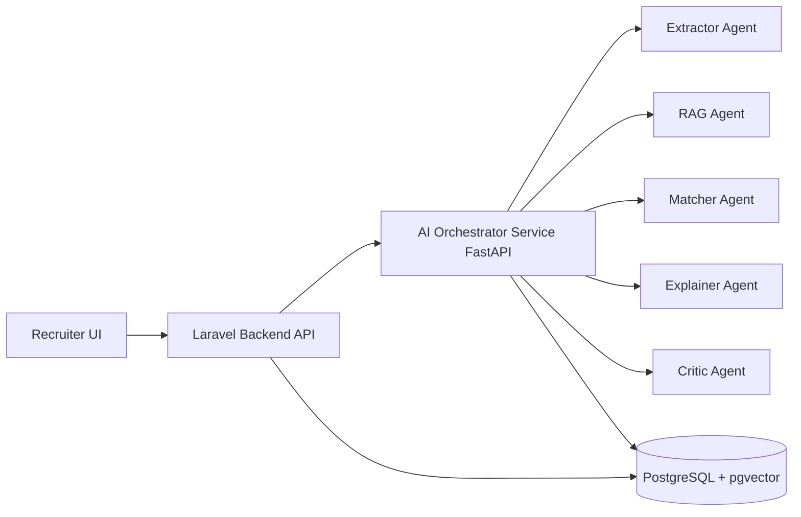

# OpenSpec - Smart CV Matcher (Level 5 Target)

## 1) Objective
- Build a **defensible AI core** for CV-JD matching, not only prompt wrapping.
- Reach near-Level-5 architecture with:
  - Multi-agent orchestration
  - Grounding (RAG + citations)
  - Explainable ranking
  - PostgreSQL + pgvector foundation
  - Dockerized reproducible demo

## 2) Target Architecture

## 3) MVC Refactor Direction (Laravel)
- **Controllers**: keep thin, validate + orchestrate.
- **Services**: move scoring/matching pipeline into `app/Services`.
- **Models**: keep domain state only.
- **Views**: demo dashboard + explainability panel (reasoning + evidence).

## 4) AI Modules (Current Scaffold)
- `ExtractorAgent`: normalize candidate + JD structure
- `RAGAgent`: return supporting evidence
- `MatcherAgent`: compute fit score with skill overlap
- `ExplainerAgent`: produce reason chain
- `CriticAgent`: sanity-check and adjust weakly-supported scores

## 5) API Contracts
- Laravel endpoint: `POST /api/ml/ai-match`
- AI service endpoint: `POST /api/v1/match`
- Response contains:
  - fit score
  - matched/missing skills
  - reasoning list
  - evidence list
  - agent execution trace

## 6) Next Upgrades for True Level-5
- Replace mock corpus with pgvector retrieval (company docs + Korean culture corpus).
- Add evaluation suite (Precision@K, nDCG, rationale quality rubric).
- Add fallback + guardrails (PII redaction, confidence gates).
- Optional specialized model:
  - CV inflation classifier
  - skill graph reasoning module
