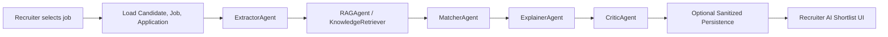

# OpenSpec — Smart CV Matcher System Specification

## Product Identity

Smart CV Matcher is an **AI-assisted CV-to-JD matching product demo**, not a full HR management platform.

| Attribute | Value |
|-----------|-------|
| **Primary use case** | Recruiter AI shortlist — ranked candidate matching |
| **Supporting use case** | Candidate advisory — soft fit indication and improvement hints |
| **Product category** | Explainable AI-assisted recruitment decision support |
| **Current status** | Demo-ready MVP (`v1.0-demo`) |
| **Not in scope** | Interview management, payroll, enterprise HR workflows |

The system is intentionally narrowed to the AI CV matching workflow for demo and implementation clarity.

---

## Product Story

KTC receives hundreds of CVs each week, but manually screening and matching them to Korean-company job descriptions takes significant recruiter time and creates inconsistency in shortlist quality.

Smart CV Matcher is a recruiter-centered AI workflow that:
- reads CV and job data from the existing application system
- extracts structured candidate and job profiles
- matches candidates to Korean-company JDs using hybrid AI scoring
- ranks candidates in a recruiter shortlist
- explains why a candidate fits, what is missing, and which risks remain

---

## Scope

### In Scope
- CV/JD ingestion from existing `Candidate`, `Job`, and `Application` data
- structured extraction of candidate and job profiles
- retrieval grounding with a knowledge corpus
- hybrid weighted scoring
- recruiter shortlist UI
- fit explanations, missing skills, and risk flags
- refresh/re-run for one application AI result
- evaluation command and demo support workflow

### Out of Scope
- interview voice analysis / ASR
- computer vision CV layout parsing beyond current implementation
- GNN-based skill graph reasoning
- fine-tuned SLM classifier
- production analytics and enterprise reporting
- large-scale background orchestration
- broad HR workflows beyond CV matching

---

## AI System Responsibilities

The AI system is responsible for:

1. **Reading CV/profile and JD data** — consuming structured and unstructured candidate/job context from Laravel models
2. **Extracting structured profiles** — producing normalized `CandidateProfile` and `JobProfile` from raw text and JSON
3. **Normalizing skills and seniority** — mapping variations to canonical forms for accurate matching
4. **Grounding with knowledge context** — using RAG retrieval to add domain evidence
5. **Computing deterministic weighted fit scores** — producing reproducible numeric scores, not LLM-generated numbers
6. **Generating explanation and risk flags** — building recruiter-readable rationale
7. **Returning sanitized match results** — for audit-safe Laravel persistence

---

## AI Design Principles

| Principle | Description |
|-----------|-------------|
| **LLM is not the scoring engine** | The LLM extracts profiles and generates explanations. The `fit_score` is computed deterministically by the MatcherAgent using weighted formulas. |
| **Deterministic scoring** | Given the same candidate and job profiles, the fit_score must be reproducible. No LLM randomness in the score. |
| **Explainability required** | Every score must be accompanied by matched/missing skills, score breakdown by component, and human-readable risk flags. |
| **Fallback behavior is mandatory** | Every pipeline stage must degrade gracefully — no hard failures that block the recruiter from seeing results. |
| **Sanitized persistence only** | Only audit-safe fields are written to the database. No raw candidate text, no LLM reasoning traces, no evidence excerpts. |
| **Role-differentiated presentation** | Recruiters see scores, rank labels, confidence, and detailed breakdowns. Candidates see softer advisory language without harsh scores or rejection framing. |

---

## Current Architecture

The system uses a hybrid AI architecture with explicit fallback behavior.

### A. Data Sources
- Laravel model: `Candidate`
- Laravel model: `Job`
- Laravel model: `Application`
- `applications.cv_data` is the richest CV source when available
- `candidate.summary`, `candidate.about_me`, `candidate.work_experiences`, `candidate.skills_json`, and `candidate.profile_data` are used as fallback candidate context

### B. Extraction Layer
- LLM-based structured extraction for candidate and job profiles
- heuristic fallback extraction when LLM is unavailable or fails
- PII masking before candidate content is sent to the LLM
- outputs:
  - `CandidateProfile`
  - `JobProfile`

### C. Grounding Layer
- OpenAI embeddings
- PostgreSQL with `pgvector`
- `knowledge_documents` corpus for grounding
- static fallback corpus when DB retrieval or embeddings are unavailable

### D. Matching Layer
- deterministic weighted hybrid scoring
- components:
  - required skill coverage
  - preferred skill coverage
  - experience fit
  - seniority fit
  - domain relevance
  - confidence adjustment

### E. Explanation Layer
- matched skills
- missing required skills
- missing preferred skills
- risk flags
- evidence source metadata
- recruiter-facing explanation

### F. Persistence Layer
- sanitized `ai_match_result` stored on `applications`
- explicit `application_id` is required for persistence
- fallback application lookup may still be used for CV enrichment, but not as a write target

---

## Orchestration Flow

1. Recruiter selects a job.
2. System loads job, application, and candidate context.
3. Extractor produces structured `CandidateProfile` and `JobProfile`.
4. Retriever grounds the job context with evidence from `knowledge_documents` or the static fallback corpus.
5. Matcher computes the weighted fit score and detailed score breakdown.
6. Explainer builds recruiter-facing rationale and missing-skill explanation.
7. Critic validates edge cases and adjusts confidence-related notes.
8. Sanitized result is optionally persisted when explicit application context exists.
9. Recruiter views ranked shortlist output in the admin flow.



---

## Component Registry

### 1. `ExtractorAgent`
- Purpose: Produce structured candidate and job profiles
- Key inputs: `CandidatePayload`, `JobPayload`
- Key outputs: `CandidateProfile`, `JobProfile`
- Main files:
  - `ai-service/app/services/agents.py`
  - `ai-service/app/services/extractor.py`

### 2. `RAGAgent`
- Purpose: Retrieve grounding evidence for job-context matching
- Key inputs: `JobProfile`, job raw payload
- Key outputs: evidence items and retrieval method
- Main files:
  - `ai-service/app/services/agents.py`
  - `ai-service/app/services/retriever.py`

### 3. `MatcherAgent`
- Purpose: Compute deterministic hybrid fit scores
- Key inputs: `CandidateProfile`, `JobProfile`
- Key outputs:
  - `fit_score`
  - `score_breakdown`
  - `matched_skills`
  - `missing_skills`
  - `missing_preferred_skills`
  - `risk_flags`
  - `confidence_label`
- Main file:
  - `ai-service/app/services/agents.py`

### 4. `ExplainerAgent`
- Purpose: Convert matching output into recruiter-readable rationale
- Key inputs: match result, evidence, candidate profile, job profile
- Key outputs: structured reasoning list
- Main file:
  - `ai-service/app/services/agents.py`

### 5. `CriticAgent`
- Purpose: Validate high/low confidence cases and add caution notes
- Key inputs: fit score, reasoning
- Key outputs: adjusted score and validation notes
- Main file:
  - `ai-service/app/services/agents.py`

### 6. `KnowledgeRetriever`
- Purpose: Manage embedding generation, corpus seeding/backfill, and pgvector retrieval
- Key inputs: retrieval query, knowledge corpus data
- Key outputs: ranked evidence list and retrieval method
- Main files:
  - `ai-service/app/services/retriever.py`
  - `ai-service/app/services/db.py`

### 7. `MatchOrchestrator`
- Purpose: Coordinate extraction, grounding, matching, explanation, and critic steps
- Key inputs: `MatchRequest`
- Key outputs: `MatchResponse`
- Main file:
  - `ai-service/app/services/orchestrator.py`

### 8. `AICVMatcherController`
- Purpose: Laravel API entrypoint for one candidate/job AI match request
- Key inputs:
  - `candidate_id`
  - `job_id`
  - optional `application_id`
- Key outputs:
  - AI match response payload
  - sanitized persistence when allowed
- Main file:
  - `backend/app/Http/Controllers/Api/AICVMatcherController.php`

### 9. `AdminController` shortlist flow
- Purpose: Recruiter/admin shortlist page and refresh action
- Key inputs:
  - selected job
  - application context
- Key outputs:
  - ranked shortlist view
  - refresh/re-match behavior
- Main file:
  - `backend/app/Http/Controllers/AdminController.php`

---

## Public Interfaces

### AI Service
#### `POST /api/v1/match`

Request shape:
```yaml
candidate:
  id: int
  name: string | null
  summary: string | null
  about_me: string | null
  skills: list[string] | string | null
  skills_json: list[string] | string | null
  experience: string | null
  education: string | null
  work_experiences: list[dict] | list[string] | null
  profile_data: dict | list | null
  cv_data: dict | string | null
job:
  id: int
  title: string
  description: string | null
  requirements: string | null
  location: string | null
  required_skills: list[string] | null
  preferred_skills: list[string] | null
  seniority: string | null
  min_experience_years: int | null
  max_experience_years: int | null
  scoring_config: dict | null
  ai_recruiter_notes: string | null
options:
  include_reasoning: bool
application_id: int | null
```

Response shape:
```yaml
candidate_id: int
job_id: int
fit_score: float
rank_label: string
matched_skills: list[string]
missing_skills: list[string]
missing_preferred_skills: list[string]
score_breakdown: dict
risk_flags: list[string]
confidence_label: string
reasoning: list[string]
evidence: list[EvidenceItem]
retrieval_method: string
agent_trace: list[string]
candidate_profile: CandidateProfile | null
job_profile: JobProfile | null
pipeline_version: string
generated_at: string
```

### Laravel API
#### `POST /api/ml/ai-match`

Behavior:
- validates `candidate_id` and `job_id`
- validates optional `application_id`
- loads CV enrichment data from application/candidate context
- calls the AI service orchestrator
- persists only the sanitized subset when explicit `application_id` exists and matches the candidate/job

### Admin Routes
Current recruiter-facing shortlist flow:
- shortlist page route for one job
- refresh/re-match route for one application

These routes are part of the Blade-first recruiter/admin demo flow.

---

## Scoring Specification

The hybrid matcher uses deterministic weighted scoring:

| Component | Weight | Notes |
|---|---:|---|
| Required skill coverage | 40% | Core must-have skill fit |
| Preferred skill coverage | 15% | Nice-to-have match |
| Experience fit | 15% | Uses candidate experience vs extracted JD range |
| Seniority fit | 10% | Uses candidate vs JD seniority |
| Domain relevance | 10% | Uses domain keyword overlap |
| Confidence adjustment | 10% | Uses extraction confidence from candidate and job profiles |

Defaults and neutral handling:
- missing experience range -> neutral score
- no required skills -> neutral handling
- no preferred skills -> neutral handling
- no domain keywords -> neutral handling

Confidence mapping:
- `high = 1.0`
- `medium = 0.7`
- `low = 0.4`

---

## AI Match Result Contract

### Full AI service response
The AI service returns the complete `MatchResponse` including profiles, reasoning, evidence, and agent traces. This is used by the caller for display and debugging but is **not persisted**.

### Persisted subset: `applications.ai_match_result`
Only a sanitized audit-safe subset is written to the database as JSONB:

```json
{
  "fit_score": 82,
  "rank_label": "high_fit",
  "confidence_label": "high",
  "matched_skills": ["Node.js", "PostgreSQL", "Docker"],
  "missing_skills": ["Java"],
  "missing_preferred_skills": ["Kubernetes"],
  "risk_flags": ["Chưa có kinh nghiệm Java/Spring Boot"],
  "score_breakdown": {
    "required_skill_coverage": {"score": 0.83, "weight": 0.4, "weighted": 33.2, "detail": "5/6 kỹ năng bắt buộc"},
    "preferred_skill_coverage": {"score": 0.25, "weight": 0.15, "weighted": 3.75, "detail": "1/4 kỹ năng ưu tiên"},
    "experience_fit": {"score": 0.9, "weight": 0.2, "weighted": 18.0, "detail": "3 năm / yêu cầu 2-5 năm"},
    "seniority_fit": {"score": 0.85, "weight": 0.1, "weighted": 8.5, "detail": "Mid applying for Mid"},
    "domain_relevance": {"score": 0.9, "weight": 0.15, "weighted": 13.5, "detail": "Backend — phù hợp cao"}
  },
  "retrieval_method": "pgvector",
  "pipeline_version": "v1.0",
  "generated_at": "2026-05-15T12:00:00Z"
}
```

**Explicitly excluded from persistence:**
- `candidate_profile` / `job_profile`
- `reasoning` (LLM-generated text)
- `evidence` excerpts
- `agent_trace`
- any free-text candidate-derived content

### `rank_label` values
| Value | Meaning |
|-------|---------|
| `high_fit` | fit_score ≥ 80 |
| `medium_fit` | fit_score 60–79 |
| `low_fit` | fit_score < 60 |
| `error` | AI pipeline failed |
| `unknown` | no result available |

### `confidence_label` values
| Value | Meaning |
|-------|---------|
| `high` | Both profiles extracted with high confidence |
| `medium` | One or more profiles had partial extraction |
| `low` | Heuristic fallback used or significant data missing |

---

## Persistence Specification

The system persists only a sanitized audit-safe subset to `applications.ai_match_result`.

Persisted fields:
- `fit_score`
- `rank_label`
- `confidence_label`
- `score_breakdown`
- `matched_skills`
- `missing_skills`
- `missing_preferred_skills`
- `risk_flags`
- `retrieval_method`
- `pipeline_version`
- `generated_at`

Explicitly excluded:
- `candidate_profile`
- `job_profile`
- `reasoning`
- `evidence excerpts`
- `agent_trace`
- any free-text candidate-derived content

---

## Fallback Behavior

The system is designed to degrade gracefully.

Fallback cases:
- no OpenAI API key -> heuristic extraction and/or static retrieval fallback
- LLM extraction failure -> fallback extraction path
- embeddings unavailable -> static fallback corpus
- pgvector / DB bootstrap failure -> static fallback corpus
- missing AI result for shortlist -> compute on demand when allowed
- explicit persistence not allowed without `application_id` -> return result without persistence

---

## Evaluation & Demo Support

The system includes a lightweight evaluation and demo support layer:
- `php artisan eval:shortlist`
- curated small eval dataset
- shortlist demo path
- pre-warm workflow for persisted AI results before demo

This support is intended for demo validation and relative comparison, not production accuracy claims.

---

## Approved Architecture Direction

The following items represent the **approved near-term evolution** of the system. They are **not yet implemented in the MVP** but are confirmed as the next-step direction.

### Near-term (planned)
- **Static knowledge corpus first** — expand the seeded `knowledge_documents` with curated IT skill taxonomy and job-family data before investing in dynamic corpus management
- **Job scoring config overrides** — allow recruiters to adjust component weights per job via `jobs.scoring_config` (schema ready, UI/pipeline not yet connected)
- **Recruiter feedback loop** — use `ai_feedbacks` table to capture agree/disagree signals on AI match results for future evaluation (schema ready)
- **Stronger JD quality checks** — validate job description completeness before matching and surface warnings to recruiters
- **Better candidate advisory formatting** — present soft fit indication using Vietnamese labels (Mức phù hợp, Kỹ năng nên bổ sung, Gợi ý cải thiện CV) instead of raw scores

### Future (not in MVP)
- **pgvector RAG expansion** — move from static corpus to embedding-based retrieval with dynamic document management
- **Skill knowledge graph** — graph-based skill similarity for better partial-match scoring
- **Learning-to-rank** — use recruiter feedback data to train ranking models
- **Specialized SLM** — fine-tuned small language model for extraction quality improvement
- **LangGraph orchestration** — migrate agent coordination to LangGraph for better traceability

See `docs/AI_LEVEL5_ROADMAP.md` for the full aspirational architecture.

---

## Implemented Now vs Roadmap

### Implemented Now
- LLM structured extraction
- heuristic fallback extraction
- embeddings + pgvector retrieval
- hybrid weighted matcher
- recruiter shortlist UI
- sanitized persistence
- evaluation command
- structured job schema (required_skills, preferred_skills, seniority, experience range)
- ai_feedbacks table (schema ready)
- knowledge_documents Laravel migration

### Roadmap / Not Yet Implemented
- GNN-based skill graph reasoning
- fine-tuned SLM classifier
- ASR / interview voice analysis
- CV layout computer vision parser
- LangGraph migration for orchestration
- broader recruiter copilots
- recruiter scoring config UI
- recruiter feedback capture UI
- candidate advisory formatting

---

## Version / Status
- Version: `v1.0-demo`
- Status: `Demo-ready MVP`
- Last updated: `2026-05-16`
