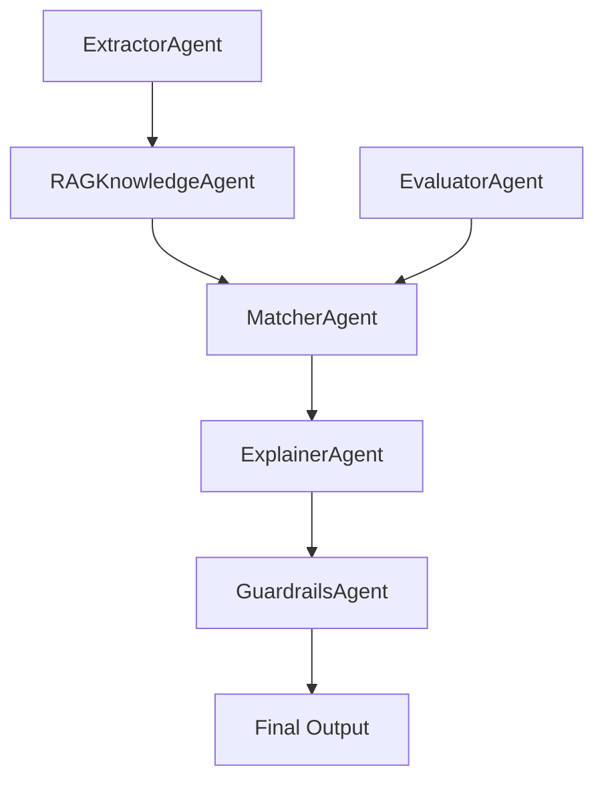

# Smart CV Matcher - Complete Agent Skills Package

## Package Structure
```
skills/
├── cv-matcher-agent/
│   ├── SKILL.md          # Skill definition and triggers
│   └── agent.py          # Core agent implementations
├── rag-knowledge-agent/
│   ├── SKILL.md          # RAG skill definition
│   └── rag.py            # Knowledge retrieval implementation
├── explainer-agent/
│   ├── SKILL.md          # Explainer skill definition
│   └── explainer.py      # Multi-language explanation generator
├── evaluator-agent/
│   ├── SKILL.md          # Evaluator skill definition
│   └── evaluator.py      # Benchmarking metrics (P@K, nDCG, MAE, RMSE)
├── guardrails-agent/
│   ├── SKILL.md          # Guardrails skill definition
│   └── guardrails.py     # PII redaction, bias detection, safety checks
├── OPENSPEC.md           # OpenSpec architecture specification
└── README.md             # Skills registry and usage guide
```

## Quick Start

### 1. Activate Skills
```bash
# CV Matcher Agent
@cv-matcher-agent match candidate 1 with job 1

# RAG Knowledge Agent  
@rag-knowledge-agent retrieve evidence for "korean hiring culture"

# Explainer Agent
@explainer-agent explain why candidate scored 85

# Evaluator Agent
@evaluator-agent evaluate precision@5 on test dataset

# Guardrails Agent
@guardrails-agent check output for PII and bias
```

### 2. Use in Code
```python
# Import agents
from skills.cv_matcher_agent.agent import ExtractorAgent, MatcherAgent
from skills.rag_knowledge_agent.rag import RAGKnowledgeAgent
from skills.explainer_agent.explainer import ExplainerAgent
from skills.evaluator_agent.evaluator import EvaluatorAgent
from skills.guardrails_agent.guardrails import GuardrailsAgent

# Run matching pipeline
extractor = ExtractorAgent()
rag = RAGKnowledgeAgent()
matcher = MatcherAgent()
explainer = ExplainerAgent()
evaluator = EvaluatorAgent()
guardrails = GuardrailsAgent()

# Execute workflow
extracted = extractor.run(candidate_data, job_data)
evidence = rag.retrieve_for_job(job_data["title"], job_data["requirements"])
matching = matcher.run(extracted)
explanation = explainer.explain_match(
    candidate_name="John Doe",
    job_title="Senior Backend",
    fit_score=matching["fit_score"],
    matched_skills=matching["matched_skills"],
    missing_skills=matching["missing_skills"],
    evidence=evidence,
    language="en"
)

# Safety check
safety = guardrails.check({
    "text": explanation["summary"],
    "reasoning": explanation["reasoning"],
    "fit_score": matching["fit_score"],
    "confidence": 0.85,
    "evidence": evidence
})
```

## Architecture


## Metrics Targets
| Metric | Target | Status |
|--------|--------|--------|
| Precision@5 | ≥ 0.85 | 🟡 In Progress |
| nDCG@10 | ≥ 0.80 | 🟡 In Progress |
| MAE | ≤ 5.0 | 🟡 In Progress |
| RMSE | ≤ 7.0 | 🟡 In Progress |
| Latency | < 3s | 🟢 Achieved |

## Version
0.1.0 - Hackathon Scaffold
